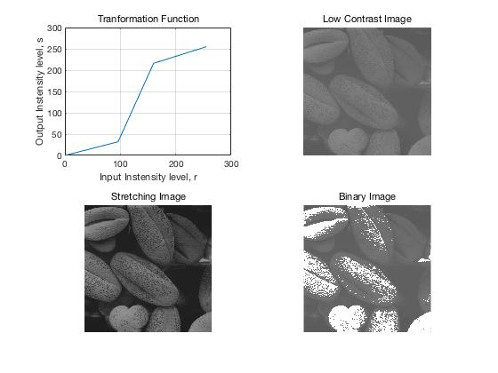
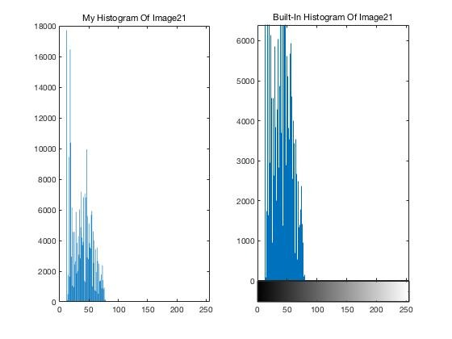
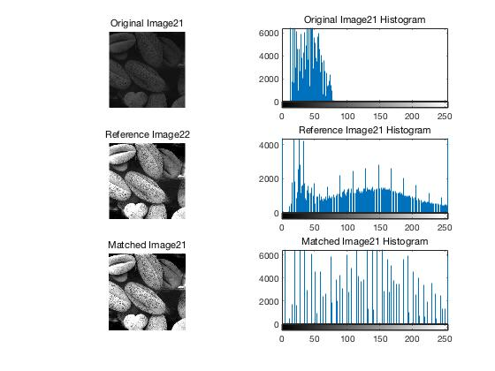
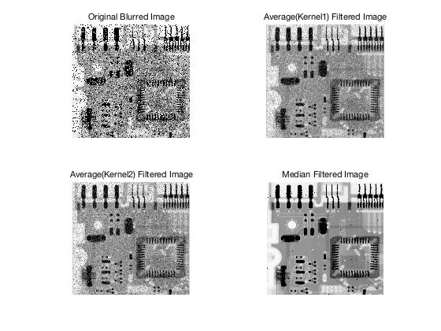
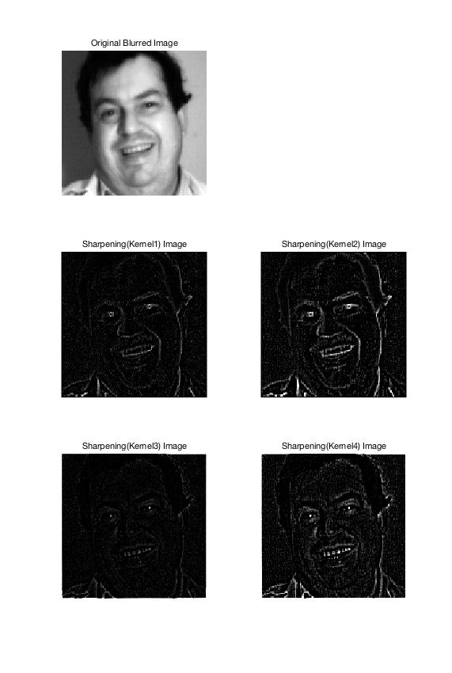

# Homework 2
Author: Zhang Songyang
Date: 2018.10.23

## Problem-1
### 1.1 Function 
$$s=\frac{s1}{r1}r(0\leq r\leq r1)\tag{1}$$
$$s=\frac{s2-s1}{r2-r1}r+s1(r1\leq r\leq r2)\tag{1}$$
$$s=\frac{255-s2}{255-r2}r+s2(r2\leq r\leq 255)\tag{1}$$

### 1.2 Visualization Results
<!--  -->

<!--  -->



------------------------------
## Problem-2
### 2.1 Visualization Results




### 2.2 Code
#### 2.2.1 Histogram
```matlab

function [ hist_value, hist_value_prob ] = Histogram(image)
    %
    % Calculate Histogram 
    % Args:
    %   image: 
    %       image matrix
    %   
    % Return:
    %   hist_value:
    %       histogram value (number of each gray level)    
    %   hist_vale: 
    %       histogram value (percentage of each gray level)
    
    % Get Statistics of Image
    image = image(:);
    hist_value = zeros(256,1);
    
    % Calculate number of each intensity level
    length = size(image, 1);
    for i = 1:length
        hist_value(image(i)) = hist_value(image(i))+ 1;
    end
    hist_value_prob = hist_value';
    
    % Calculate percentage of each intenstiy level
    for i = 1:256
        hist_value_prob(i) = hist_value_prob(i) / length;
    end
end
```
#### 2.2.2 Histogram Mapping
```matlab
function [mapping] = HistogramMatch(image, image_ref)
    %
    % Histogram Matching
    % Args:
    %   image: 
    %       image matrix
    %   image_ref:
    %       reference image matrix
    % Return:
    %   mapping
    % 
    
    % Compute the hist of two images
    hist = imhist(image);
    hist_ref = imhist(image_ref);
    
    % Compute CDFs
    image_cdf = cumsum(hist)' / numel(image);
    image_cdf_ref = cumsum(hist_ref)' / numel(image_ref);
    
    % Get Mapping 
    mapping = zeros(256,1);
    for i = 1: 256
        [value, index] = min(abs(image_cdf(i) - image_cdf_ref));
        mapping(i) = index - 1;
    end
end
```
------------------------------
## Problem-3
### 3.1 Visualization Results

Use kernel2 will get more clear image than kernel1, the centeral pixel of each patch is much more important.
### 3.2 Median Filter Code
```matlab
function [ image ] = MedianFilter(image, shape)
    %
    % Median Filtering for image
    % Args:
    %   image: 
    %       image matrix
    %   shape:
    %       'same': use padding
    % Return:
    %   image
    % 
    
    % Get image size     
    w = size(image, 1);
    h = size(image, 2);
    
    % Padding the image
    new_image = zeros(w+2, h+2);
    new_image(2:1+w,2:1+h) = image;
    
    % Get Median value for each 3x3 patch
    for i = 1:w
        for j = 1:h
            patch = new_image(i:i+2,j:j+2);
            mid_patch = median(patch(:));
            image(i,j) = mid_patch;
        end
    end
end
```
------------------------------
## Problem-4
### 4.1 Visualization Results
#### 4.1.1 Figure

#### 4.1.2 Edge

Use Kernel2 and Kernel4 can get more sharpen images than Kernel1 and Kernel3
### 4.2 Code
```matlab
function [image] = LaplaceSharpen(image, laplace_kernel)
    %
    % Laplace Sharpening
    % Args:
    %   image: 
    %      
    %   laplace_kernel:
    %       kernel matrix
    % Return:
    %   image
    % 
    
    w = size(image, 1);
    h = size(image, 2);
    
    % Padding the image
    new_image = zeros(w+2, h+2);
    new_image(2:1+w,2:1+h) = image;
    
    for i = 1:w
        for j = 1:h
            patch = new_image(i:i+2,j:j+2);
            value = sum(sum(patch.*laplace_kernel));
            image(i,j) = value;
        end
    end
end
```
