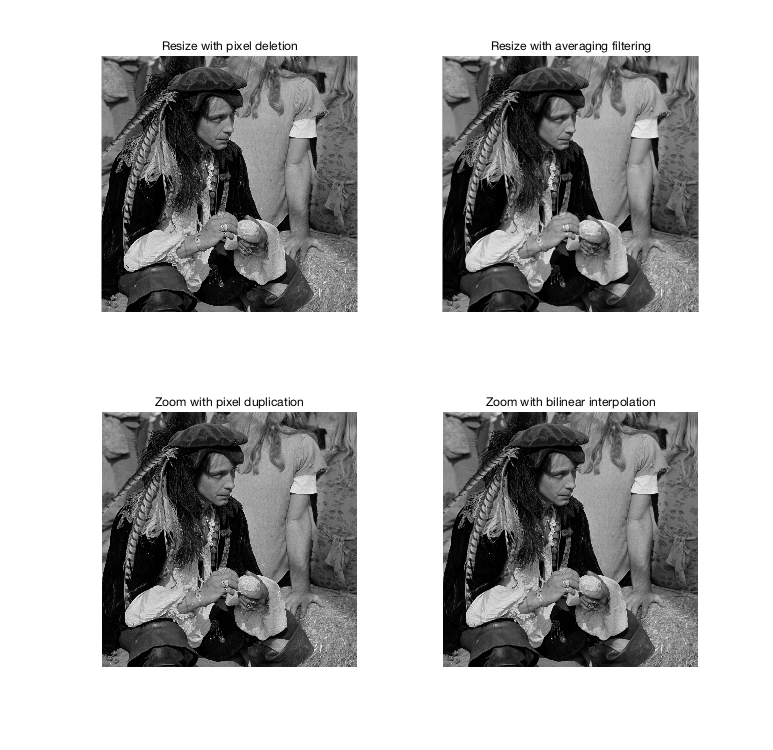
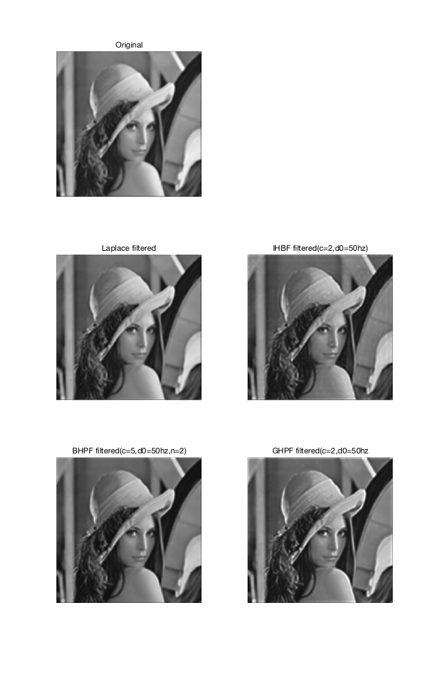
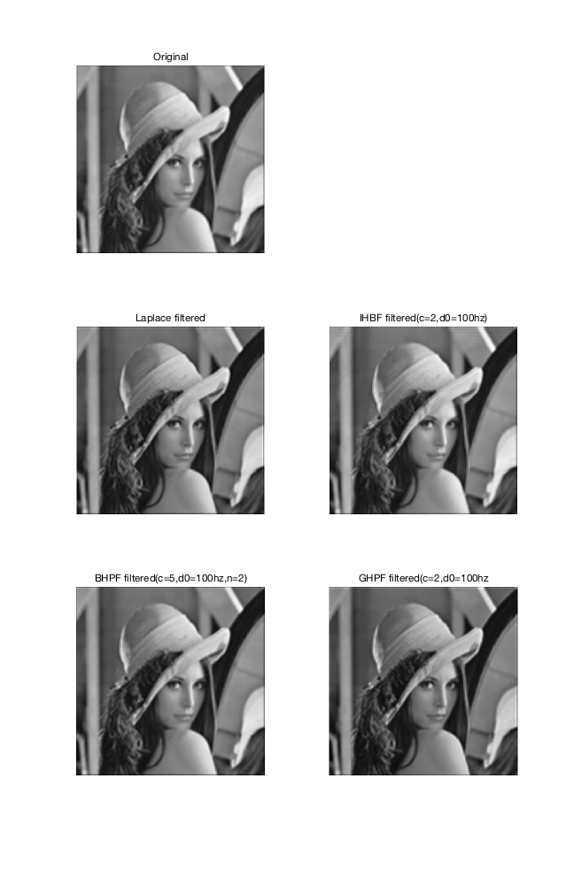
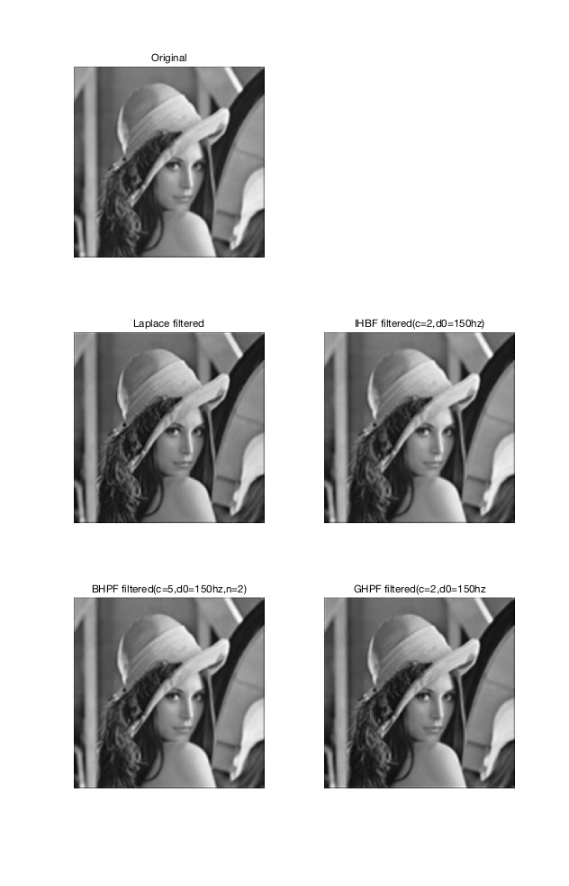
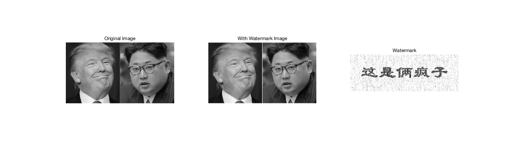

# Homework3 Solution
Name: 张松阳
ID: 52289120

## Problem 1

<!--  -->
#### Compare:
直接deletion得到的图像更锐化，但是会出现混叠现象
使用均值滤波后更平滑，保留了更多的低频分量，有利于降采样。

#### Comment 2:
pixel duplication 计算量小、运算速度快，但容易产生失真，不适合处理具有大量细节的图像
bilinear interpolation的运算量比像素复制方法大，但是其处理结果更接近于原图像的细节
## Problem 2

<!--  -->
<!--  -->
<!--  -->
#### Comment 1:
截止频率越大，保留的高频信息越少，锐化成都降低
#### Comment 2:
c 越大， 高频分量占比越高，锐化效果更明显，但会更容易出现波纹效果
#### Comment 3:
从IHPF,BHPF 到GHPF，边缘失真现象减弱，图像更加平滑。

## Problem 3
### Steps
1. 对加密图像和原图像做DCT变换
2. 将变换后的谱按行拉成一个向量，并将原图像的谱按幅值降序排列，获得降序的index
3. 按降序index取加密图像的谱的值与原图像的谱做差, 取前106*312个值，并reshape为二维图像，注意行列顺序，需要进行转置。
4. 差值除以缩放系数
4. iDCT变换得到加密图像。
### Visual Results

